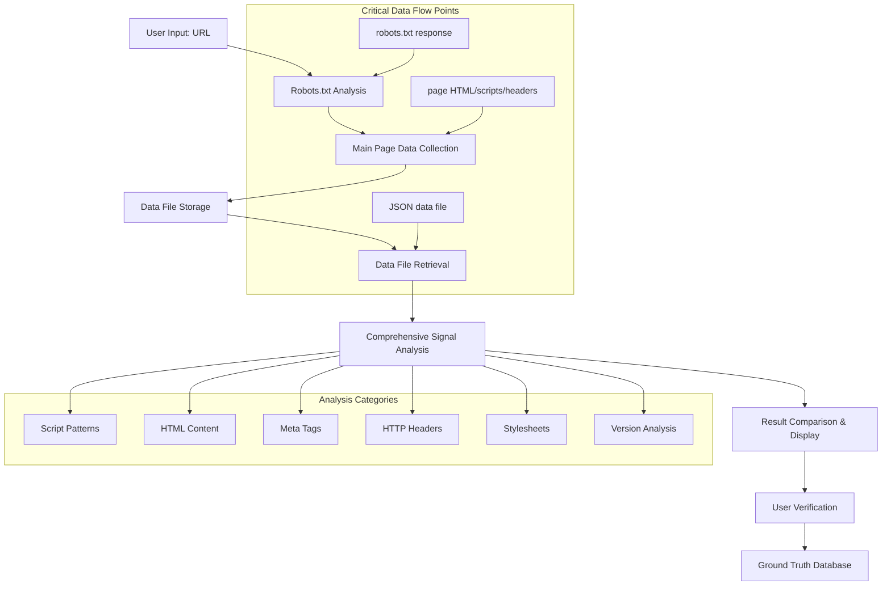
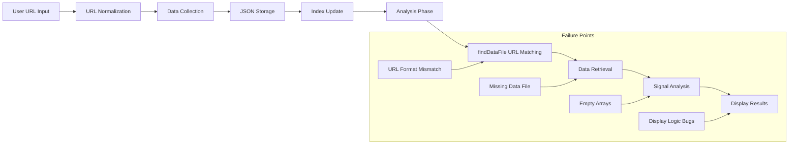

# Ground-Truth Command: Comprehensive Architecture Guide

## Overview

The ground-truth command is a sophisticated CMS detection and verification system that combines automated analysis with human validation to build high-quality training datasets. This document provides a complete technical overview of how the command works, with special focus on data retrieval, analysis, and display processes where bugs have historically occurred.

## High-Level Workflow



## Phase 1: Data Retrieval

### 1.1 Robots.txt Analysis

**Component**: `RobotsTxtAnalyzer`
**Location**: `src/utils/robots-txt-analyzer.ts`

#### Process:
1. **URL Construction**: Constructs robots.txt URL from base URL
   ```typescript
   const robotsUrl = new URL('/robots.txt', parsedUrl.origin).toString();
   ```

2. **HTTP Request**: Fetches robots.txt with timeout and retry logic
   ```typescript
   const response = await withRetry(async () => {
       return await fetch(robotsUrl, {
           headers: { 'User-Agent': this.userAgent },
           signal: controller.signal
       });
   });
   ```

3. **Content Analysis**: Parses disallow rules for CMS-specific patterns
   - WordPress: `/wp-admin/`, `/wp-content/`
   - Drupal: `/admin/`, `/user/`
   - Joomla: `/administrator/`, `/components/`

4. **Header Analysis**: Examines HTTP response headers for CMS signals
   - `X-Powered-By`, `X-Generator`, server headers

#### Data Sources:
- **Primary**: robots.txt file content
- **Secondary**: HTTP response headers from robots.txt request
- **Metadata**: Response status, timing, error information

### 1.2 Main Page Data Collection

**Component**: `CMSDetectionIterator` + `DataCollector`
**Location**: `src/utils/cms/index.ts`, `src/utils/cms/analysis/collector.ts`

#### Process:
1. **Browser Initialization**: Creates isolated browser context
   ```typescript
   cmsIterator = new CMSDetectionIterator({
       collectData: true,
       collectionConfig: {
           includeHtmlContent: true,
           includeDomAnalysis: true,
           includeScriptAnalysis: true,
           maxHtmlSize: 500000
       }
   });
   ```

2. **Page Navigation**: Navigates to target URL with comprehensive data collection
3. **Data Extraction**: Collects multiple data categories:
   - **HTML Content**: Full page HTML (up to 500KB)
   - **Scripts**: All script tags with src attributes and inline content
   - **Stylesheets**: Link tags and style elements
   - **Meta Tags**: All meta elements with name/content pairs
   - **HTTP Headers**: Response headers from main page request
   - **DOM Elements**: CMS-specific DOM patterns
   - **Forms**: Form elements and field types
   - **Links**: Href attributes and link relationships

#### Data Storage:
- **Location**: `./data/cms-analysis/`
- **Index File**: `index.json` - Maps URLs to data files
- **Data Files**: Individual JSON files with comprehensive page data
- **Naming**: Timestamp-based with base64 URL encoding

### 1.3 Critical Data Flow Point: URL Format Mismatch

**Historical Bug**: Data file lookup failures due to URL format inconsistencies

#### Problem:
```typescript
// Data collection stores: "lamaisondaffichage.ca"
// Ground-truth searches: "https://lamaisondaffichage.ca"
// Result: No match found, analysis fails
```

#### Solution (Fixed):
```typescript
private normalizeUrlForDataFileSearch(url: string): string {
    let normalized = url.toLowerCase().trim();
    normalized = normalized.replace(/^https?:\/\//, '');    // Remove protocol
    normalized = normalized.replace(/^www\./, '');          // Remove www
    normalized = normalized.replace(/\/$/, '');             // Remove trailing slash
    return normalized;
}
```

## Phase 2: Data Analysis

### 2.1 Data File Retrieval

**Method**: `findDataFile(url: string)`
**Location**: `src/commands/ground-truth.ts:324-356`

#### Process:
1. **Index Loading**: Reads `./data/cms-analysis/index.json`
2. **URL Normalization**: Normalizes both search and stored URLs
3. **Entry Matching**: Finds most recent matching entry
4. **File Path Resolution**: Returns absolute path to data file

#### Critical Fix:
Added URL normalization to handle protocol/format mismatches between data collection and analysis phases.

### 2.2 Comprehensive Signal Analysis

**Method**: `showComprehensiveSignalAnalysis(data: any)`
**Location**: `src/commands/ground-truth.ts:984-1006`

The analysis is divided into six distinct categories:

#### 2.2.1 Script Pattern Analysis

**Method**: `analyzeScriptSignals(data: any)`
**Domain Validation**: ✅ **Required for accuracy**

```typescript
// WordPress patterns (same-domain only)
const wpContentScripts = scripts.filter((s: any) => 
    s.src && 
    s.src.toLowerCase().includes('/wp-content/') && 
    this.isSameDomainScript(s.src, targetUrl)
);
```

**Patterns Detected**:
- WordPress: `/wp-content/`, `/wp-includes/`
- Drupal: `/sites/`, `/core/`
- Joomla: `/media/jui/js/`, `/media/`, `/components/`
- Common: jQuery (non-redundant), Bootstrap

**Domain Validation Logic**:
```typescript
private isSameDomainScript(scriptUrl: string, targetUrl: string): boolean {
    // Relative URLs are always same-domain
    if (!scriptUrl.startsWith('http')) return true;
    
    const scriptDomain = new URL(scriptUrl).hostname.toLowerCase();
    const targetDomain = new URL(targetUrl).hostname.toLowerCase();
    
    // Only exact matches (blog.example.com ≠ example.com)
    return scriptDomain === targetDomain;
}
```

#### 2.2.2 HTML Content Pattern Analysis

**Method**: `analyzeHtmlSignals(data: any)`
**Domain Validation**: ✅ **Fixed - Previously caused false positives**

```typescript
// WordPress patterns with domain validation
const wpContentMatch = this.hasSameDomainHtmlPattern(data.htmlContent, 'wp-content', targetUrl);
const wpContentCount = wpContentMatch ? this.countSameDomainHtmlPatterns(data.htmlContent, 'wp-content', targetUrl) : 0;
```

**Historical Bug**: Used simple regex counting without domain validation:
```typescript
// ❌ BUG: No domain validation
const wpContentCount = (html.match(/wp-content/g) || []).length;
// This counted external references like blog.logrocket.com/wp-content/
```

**Fixed Implementation**:
```typescript
// ✅ FIXED: Domain-aware counting
const wpContentCount = this.countSameDomainHtmlPatterns(html, 'wp-content', data.url);
```

**Pattern Detection Logic**:
1. **Absolute URL Analysis**: Extracts domain from full URLs containing patterns
2. **Relative URL Analysis**: Identifies genuine relative URLs vs patterns within absolute URLs
3. **Context Checking**: Examines surrounding text to distinguish URL contexts

#### 2.2.3 Meta Tag Signal Analysis

**Method**: `analyzeMetaSignals(data: any)`
**Domain Validation**: N/A (Meta tags are inherently same-domain)

```typescript
const generator = metaTags.find((tag: any) => tag.name === 'generator');
const generatorContent = generator?.content || '';

signals.push({
    signal: 'WordPress generator tag',
    confidence: 'high' as const,
    match: generatorContent.toLowerCase().includes('wordpress'),
    cms: 'WordPress',
    content: generatorContent.toLowerCase().includes('wordpress') ? generatorContent : undefined
});
```

#### 2.2.4 HTTP Header Analysis

**Method**: `analyzeHeaderSignals(data: any)`
**Data Sources**: Both main page and robots.txt headers

```typescript
const mainHeaders = data.httpHeaders || {};
const robotsHeaders = data.robotsTxt?.httpHeaders || {};
```

**WordPress Headers**:
- `X-Pingback`: WordPress XML-RPC endpoint
- `Link` header with `wp-json`: REST API endpoint

**Drupal Headers**:
- `X-Drupal-Cache`: Drupal caching system
- `X-Generator`: Drupal version information

#### 2.2.5 Stylesheet Pattern Analysis

**Method**: `analyzeStylesheetSignals(data: any)`
**Domain Validation**: ❌ **Potential vulnerability** (documented as needing review)

Similar to script analysis but for CSS files:
- WordPress: `/wp-content/themes/`, `/wp-content/plugins/`
- Drupal: `/themes/`, `/modules/`
- Joomla: `/templates/`, `/media/`

#### 2.2.6 Version Analysis

**Method**: `analyzeVersionSignals(data: any)`
**Priority Order**: meta-generator > http-header > script-path

```typescript
// Version extraction with priority ordering
const priorityOrder = {
    'meta-generator': 3,
    'http-header': 2,
    'script-path': 1
};
```

## Phase 3: Result Display

### 3.1 Display Architecture

The display system has two modes and multiple potential mismatch points:

#### 3.1.1 Compact Mode (`--compact`)
```typescript
if (this.compactMode) {
    console.log(`   🌐 main page: ${result.cms} (${(result.confidence * 100).toFixed(1)}%) | ${result.executionTime}ms`);
    console.log(`   📊 Final: ${finalCms} (${(finalConfidence * 100).toFixed(1)}%) via ${method}`);
}
```

#### 3.1.2 Verbose Mode (Default)
```typescript
console.log(`🔬 Discriminative Signal Analysis:`);
this.displaySignalCategory('SCRIPT PATTERNS', scriptSignals);
this.displaySignalCategory('HTML CONTENT PATTERNS', htmlSignals);
// ... other categories
```

### 3.2 Signal Category Display Logic

**Method**: `displaySignalCategory(title: string, signals: Array<...>)`
**Location**: `src/commands/ground-truth.ts:1533-1596`

#### Critical Display Logic:
```typescript
// Show matching signals
const matchingSignals = signals.filter(s => s.match);
matchingSignals.forEach(signal => {
    const icon = matchIcon(true);
    const examples = signal.examples?.slice(0, 2).join(', ') || '';
    console.log(`   ${icon} ${signal.signal}`);
    if (examples) console.log(`     ${examples}`);
});

// Show "No patterns found" only if ALL signals are missing
const missingSignals = signals.filter(s => !s.match && s.cms);
if (matchingSignals.length === 0 && missingSignals.length > 0) {
    const missingSummary = missingSignals.map(s => s.signal.split(' ')[0]).join(', ');
    console.log(`   ${matchIcon(false)} No ${missingSummary} patterns found`);
}
```

#### Historical Bug: Incorrect "No Patterns Found" Display
**Problem**: Showing "No patterns found" when some patterns actually matched
**Root Cause**: Display logic didn't check if any patterns matched before showing the message
**Fix**: Added condition to only show message when ALL patterns are missing

## Phase 4: Data Flow Integrity

### 4.1 Critical Data Dependencies



### 4.2 Data Validation Checkpoints

1. **Data Collection Validation**:
   ```typescript
   // Ensure data was actually collected
   if (scripts.length === 0) {
       logger.warn('No scripts collected for analysis');
   }
   ```

2. **Data File Validation**:
   ```typescript
   const dataPath = this.findDataFile(url);
   if (!dataPath) {
       console.warn('⚠️ No data file found for comprehensive analysis');
       return [];
   }
   ```

3. **Analysis Validation**:
   ```typescript
   // Validate data structure before analysis
   const scripts = data.scripts || [];
   const targetUrl = data.url || '';
   ```

### 4.3 Error Handling Strategy

1. **Graceful Degradation**: Continue analysis even if some data is missing
2. **Detailed Logging**: Log data availability and analysis results
3. **User Feedback**: Show warning messages for missing data
4. **Fallback Analysis**: Use robots.txt analysis when main page analysis fails

## Historical Bug Summary

### Bug 1: Subdomain Cross-Domain False Positives
- **Issue**: wp-content references from CDNs counted as WordPress signals
- **Impact**: Inflated confidence scores for wrong CMS
- **Fix**: Implemented strict domain validation in HTML pattern analysis

### Bug 2: URL Format Mismatch in Data File Lookup
- **Issue**: Exact string matching failed between search and stored URLs
- **Impact**: "No patterns found" even when data was collected
- **Fix**: Added URL normalization for consistent matching

### Bug 3: Incorrect "No Patterns Found" Display
- **Issue**: Showed negative message when some patterns actually matched
- **Impact**: Confusing user feedback and false negative appearance
- **Fix**: Updated display logic to only show message when ALL patterns missing

### Bug 4: jQuery Redundancy with WordPress Patterns
- **Issue**: Showed jQuery and wp-includes simultaneously
- **Impact**: Redundant and confusing signal display
- **Fix**: Only show jQuery when no WordPress-specific patterns exist

## Best Practices for Maintenance

### 1. Data Flow Validation
- Always check data availability before analysis
- Validate URL normalization consistency
- Ensure proper error handling at each phase

### 2. Display Logic Testing
- Test edge cases: all patterns missing, some patterns missing, all patterns found
- Verify consistency between analysis results and display output
- Check both compact and verbose modes

### 3. Domain Validation
- Maintain strict same-domain validation for scripts and HTML patterns
- Document any exceptions or special cases
- Regular testing with cross-domain content

### 4. Version Compatibility
- Ensure data format compatibility across versions
- Handle legacy data gracefully
- Document data structure changes

## Future Considerations

1. **Enhanced Data Validation**: Add schema validation for collected data
2. **Analysis Audit Trail**: Log detailed analysis decisions for debugging
3. **Display Consistency Tests**: Automated tests comparing analysis vs display
4. **Performance Monitoring**: Track data collection and analysis performance
5. **Error Recovery**: Better handling of partial data collection failures

This architecture ensures robust CMS detection with comprehensive validation, accurate domain filtering, and reliable user feedback while maintaining data integrity throughout the analysis pipeline.