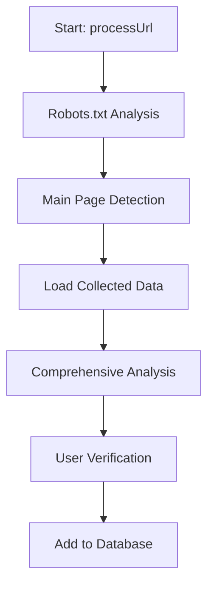

# Ground-Truth Command Documentation

## Overview

The ground-truth command is an interactive tool for building and managing a curated database of websites with verified CMS classifications. It combines automated CMS detection with human verification to create high-quality training data for improving detection accuracy.

## Purpose

- **Build Ground Truth Database**: Create a verified dataset of websites with confirmed CMS types and versions
- **Interactive Verification**: Allow human experts to verify or correct automated CMS detection results
- **Detection Analysis**: Provide comprehensive analysis of CMS detection signals and patterns
- **Research Tool**: Enable analysis of CMS detection patterns and discriminative features

## Command Usage

### Basic Usage
```bash
# Analyze a single URL
node dist/index.js ground-truth https://example.com

# Analyze multiple URLs from CSV
node dist/index.js ground-truth sites.csv

# Show database statistics
node dist/index.js ground-truth --stats

# Compact output mode
node dist/index.js ground-truth https://example.com --compact

# Batch processing (non-interactive)
node dist/index.js ground-truth sites.csv --batch
```

### Command Options
- `[input]` - URL or CSV file containing URLs to analyze
- `--stats` - Show ground truth database statistics
- `--batch` - Process multiple URLs without interactive prompts (TODO: Not yet implemented)
- `--compact` - Show compact output with less detailed analysis

## Architecture

### Core Class: `GroundTruthDiscovery`

The main class that orchestrates the ground-truth discovery process.

#### Key Properties
- `rl: readline.Interface` - Interactive user input interface
- `groundTruthPath: string` - Path to ground truth database file
- `discriminativeFeatures: DiscriminativeFeature[]` - Predefined CMS detection patterns
- `robotsAnalyzer: RobotsTxtAnalyzer` - Robots.txt analysis component
- `isShuttingDown: boolean` - Graceful shutdown flag
- `compactMode: boolean` - Output verbosity control

#### Key Methods
- `processUrl()` - Main workflow for analyzing a single URL
- `analyzeCollectedData()` - Analyze collected CMS detection data
- `promptForGroundTruthDecision()` - Interactive user verification
- `addToGroundTruth()` - Add verified entry to database

## Analysis Workflow

### 1. Initial Analysis Phase



#### Step 1: Robots.txt Analysis
- **Method**: `robotsAnalyzer.analyze(url)`
- **Purpose**: Analyze robots.txt file for CMS-specific patterns
- **Output**: CMS type, confidence level, detected signals

#### Step 2: Main Page Detection
- **Method**: `cmsIterator.detect(url)` with data collection enabled
- **Purpose**: Run full CMS detection pipeline with data collection
- **Data Collection**: HTML content, scripts, stylesheets, meta tags, HTTP headers
- **Output**: CMS detection result with confidence

#### Step 3: Data File Location
- **Method**: `findDataFile(url)`
- **Purpose**: Locate the JSON data file created during detection
- **Location**: `./data/cms-analysis/`
- **Format**: Indexed by URL in `index.json`

#### Step 4: Comprehensive Analysis
- **Method**: `analyzeCollectedData(dataPath)`
- **Purpose**: Perform detailed analysis of collected data
- **Components**: 
  - Discriminative feature evaluation
  - Signal strength calculation
  - Comprehensive signal analysis (6 categories)
  - Version detection and validation

## Signal Analysis Categories

### 1. Script Patterns
**Analyzed by**: `analyzeScriptSignals()`
**Domain Validation**: ✅ Uses `isSameDomainScript()`

- WordPress: `/wp-content/`, `/wp-includes/`
- Drupal: `/sites/`, `/core/`
- Joomla: `/media/jui/js/`, `/media/`, `/components/`
- Common: jQuery, Bootstrap

### 2. HTML Content Patterns
**Analyzed by**: `analyzeHtmlSignals()`
**Domain Validation**: ✅ Uses domain-aware counting methods

- WordPress: `wp-content`, `wp-json`, `wp-block-`
- Drupal: `drupal.settings`, `drupal.js`
- Joomla: `joomla-script-options`, `system-message`, `com_content`

### 3. Meta Tag Signals
**Analyzed by**: `analyzeMetaSignals()`
**Domain Validation**: N/A (appropriate for meta tags)

- Generator meta tag analysis
- CMS-specific meta patterns

### 4. HTTP Headers
**Analyzed by**: `analyzeHeaderSignals()`
**Domain Validation**: N/A (appropriate for headers)

- WordPress: `X-Pingback`, `wp-json` in Link header
- Drupal: `X-Drupal-Cache`, `X-Drupal-Dynamic-Cache`
- General: `X-Generator`, cookie patterns

### 5. Stylesheet Patterns
**Analyzed by**: `analyzeStylesheetSignals()`
**Domain Validation**: ❌ **POTENTIAL BUG** - No domain validation shown

- WordPress: `/wp-content/themes/`, `/wp-content/plugins/`
- Drupal: `/themes/`, `/modules/`
- Joomla: `/templates/`, `/media/`

### 6. Version Analysis
**Analyzed by**: `analyzeVersionSignals()`
**Domain Validation**: N/A (version extraction)

- Detected versions from various sources
- Version hints and patterns

## Discriminative Features

### Feature Evaluation System
**Method**: `evaluateFeature(feature, data)`

Evaluates predefined discriminative features against collected data:

```typescript
interface DiscriminativeFeature {
    feature: string;           // Feature identifier
    description: string;       // Human-readable description
    cms: string;              // Target CMS
    confidence: number;       // Confidence weight (0-1)
    type: 'script-src' | 'html-content' | 'meta-tag' | 'header' | 'dom-structure';
}
```

### WordPress Features
- `hasWpContent` - Scripts from `/wp-content/` (confidence: 0.9)
- `hasWpContentInHtml` - HTML contains wp-content references (confidence: 0.9) ✅ **Domain validated**
- `hasWpJsonLink` - HTML contains wp-json API references (confidence: 0.8) ✅ **Domain validated**

### Drupal Features
- `hasDrupalSites` - Scripts from `/sites/` directory (confidence: 0.8)

### Joomla Features
- `hasJoomlaTemplates` - Stylesheets from `/templates/` (confidence: 0.9)
- `hasJoomlaScriptOptions` - `joomla-script-options new` class (confidence: 1.0)
- `hasJoomlaJUI` - Scripts from `/media/jui/js/` (confidence: 0.95)
- `hasJoomlaMedia` - Scripts from `/media/` directory (confidence: 0.6)

### Domain Validation Logic

#### Same-Domain Script Validation
```typescript
private isSameDomainScript(scriptUrl: string, targetUrl: string): boolean {
    // Relative URLs are always same-domain
    if (!scriptUrl.startsWith('http')) return true;
    
    // Extract domains and compare exactly
    const scriptDomain = new URL(scriptUrl).hostname.toLowerCase();
    const targetDomain = new URL(targetUrl).hostname.toLowerCase();
    
    // Only exact matches (blog.example.com ≠ example.com)
    return scriptDomain === targetDomain;
}
```

#### Same-Domain HTML Pattern Validation
```typescript
private hasSameDomainHtmlPattern(htmlContent: string, pattern: string, targetUrl: string): boolean {
    const targetDomain = this.extractDomain(targetUrl);
    
    // 1. Check absolute URLs containing the pattern
    const urlRegex = new RegExp(`https?://[^\\s"']+${pattern}[^\\s"']*`, 'gi');
    const matches = htmlContent.match(urlRegex);
    
    if (matches) {
        for (const match of matches) {
            const matchDomain = this.extractDomain(match);
            if (this.isSameDomain(targetDomain, matchDomain)) {
                return true;
            }
        }
    }
    
    // 2. Check relative URLs (implicitly same-domain)
    const relativeRegex = new RegExp(`/${pattern}`, 'gi');
    let match;
    
    while ((match = relativeRegex.exec(htmlContent)) !== null) {
        const matchIndex = match.index;
        
        // Check 50 characters before match for protocol indicators
        const contextStart = Math.max(0, matchIndex - 50);
        const beforeContext = htmlContent.substring(contextStart, matchIndex);
        
        // Skip if part of absolute URL
        if (beforeContext.includes('http://') || beforeContext.includes('https://')) {
            continue;
        }
        
        // Valid relative URL
        return true;
    }
    
    return false;
}
```

## Interactive User Interface

### Confidence-Based Interaction

#### High Confidence (≥90%)
```
[Enter] WordPress 6.3.1  [c] Correct  [s] Skip  [?] Help
```
- Auto-suggest detection with one-key acceptance
- Minimal friction for obvious cases

#### Medium Confidence (70-90%)
```
[Enter] WordPress 6.3.1  [c] Correct  [s] Skip  [?] Help
```
- One-key decisions with clear suggestion
- Moderate confidence cases

#### Low Confidence (<70%)
```
[1] WordPress  [2] Drupal  [3] Joomla  [4] Other/Static  [s] Skip
Classification needed: 
```
- Explicit choice required
- Manual classification for uncertain cases

### User Actions
- **Enter/y** - Accept suggested classification
- **c** - Correct the CMS type or version (launches correction flow)
- **s** - Skip this site (don't add to ground truth)
- **?** - Show help information
- **1-4** - Select CMS type (low confidence mode)

### Correction Flow
```
Actual CMS (WordPress/drupal/Joomla/other): drupal
Version (detected: 10.1.5) or Enter for detected: 
Notes (optional): Custom theme, non-standard installation
Continue to next URL? (y/n): y
```

## Database Management

### Database Structure
```typescript
interface GroundTruthDatabase {
    version: string;
    lastUpdated: string;
    sites: GroundTruthSite[];
}

interface GroundTruthSite {
    url: string;                    // Normalized URL
    cms: string;                    // Verified CMS type
    version?: string;               // CMS version (if known)
    confidence: number;             // Detection confidence at time of verification
    addedAt: string;               // ISO timestamp
    verifiedBy: string;             // 'ground-truth-discovery'
    notes?: string;                 // Optional human notes
    detectedVersion?: string;       // Version detected by automation
    versionSource?: string;         // Source of version detection
}
```

### URL Normalization
**Method**: `normalizeUrlForGroundTruth(url)`

Normalizes URLs for consistent database storage:
1. Add protocol (default HTTPS)
2. Normalize to HTTPS
3. Add www prefix for common domains
4. Remove trailing slashes
5. Remove default ports (80/443)
6. Remove query parameters
7. Domain normalization

Example:
- `example.com` → `https://www.example.com`
- `http://site.org/` → `https://www.site.org`
- `https://test.com:443/page?q=1` → `https://www.test.com/page`

### Storage Location
- **Database File**: `./data/ground-truth-sites.json`
- **Data Files**: `./data/cms-analysis/` (referenced for version detection)

## Version Detection

### Version Sources (Priority Order)
1. **meta-generator** (highest priority) - Generator meta tag
2. **http-header** (high priority) - HTTP headers like X-Powered-By
3. **script-path** (lowest priority) - Script URL parameters

### Version Validation
Validates detected versions against known CMS version patterns:

- **WordPress**: 4.0-10.x (modern versions only)
- **Drupal**: 6.x-11.x (including major-only versions)
- **Joomla**: 1.x-5.x

### Version Extraction Patterns
```typescript
// Generator meta tag
wordpress[^\d]*(\d+\.\d+(?:\.\d+)?)

// Script paths (WordPress core files only)
/wp-admin/js/(common|wp-admin|dashboard).*[?&]ver=(\d+\.\d+(?:\.\d+)?)

// HTTP headers
(wordpress|drupal|joomla)[^\d]*(\d+(?:\.\d+)?(?:\.\d+)?)
```

## Output Modes

### Standard Mode
Full detailed analysis with:
- Complete signal breakdown
- Discriminative feature analysis
- Signal strength visualization
- Comprehensive category analysis
- Version detection details

### Compact Mode (`--compact`)
Condensed output showing:
- Key detection results only
- Final decision with method comparison
- Version information (if detected)
- Minimal diagnostic output

Example compact output:
```
🔍 Analyzing: https://example.com
   🤖 robots.txt: WordPress (85.0%) via wp-admin disallow
   🌐 main page: WordPress (92.3%) | 3582ms
   🔢 Version: 6.3.1 (meta-generator)
   ✅ Final: WordPress (92.3%) - both methods agree
```

## Error Handling and Edge Cases

### Graceful Shutdown
- **SIGINT handling**: Ctrl+C gracefully terminates
- **Readline cleanup**: Prevents hanging processes
- **Resource cleanup**: Proper disposal of file handles and network connections

### Non-TTY Support
- **Piped input**: Auto-accepts suggestions when stdin is not a terminal
- **Automation friendly**: Supports scripted execution

### File System Operations
- **Directory creation**: Automatically creates data directories
- **Backup handling**: Safely updates existing database files
- **Error recovery**: Continues processing on individual URL failures

## Known Issues and Limitations

### Fixed Issues

#### ✅ Fixed: URL Format Mismatch in Data File Lookup
**Issue**: The `findDataFile()` method used exact string matching between search URLs (with protocol) and stored URLs (without protocol), causing data file lookup failures.

**Impact**: Ground-truth command would show "No patterns found" for script analysis even when scripts were properly collected, because it couldn't locate the data file.

**Location**: `src/commands/ground-truth.ts:324-356`

**Root Cause**: 
```typescript
// ❌ BUG: Exact string match failed
const entry = indexArray.filter((item: any) => item.url === url)

// Search: "https://lamaisondaffichage.ca"
// Stored: "lamaisondaffichage.ca"
// Result: No match found
```

**Solution**: Added URL normalization for consistent matching:
```typescript
// ✅ FIXED: Normalize both search and stored URLs
const normalizedSearchUrl = this.normalizeUrlForDataFileSearch(url);
const entry = indexArray.filter((item: any) => {
    const normalizedStoredUrl = this.normalizeUrlForDataFileSearch(item.url);
    return normalizedStoredUrl === normalizedSearchUrl;
})
```

**Fixed in**: v17.1.0

#### ✅ Fixed: Inconsistent Domain Validation
**Issue**: The `analyzeHtmlSignals()` method in comprehensive analysis did not perform domain validation, causing false positives.

**Impact**: External references (e.g., `https://blog.logrocket.com/wp-content/`) were counted as WordPress signals for `logrocket.com`.

**Location**: `src/commands/ground-truth.ts:1020-1098`

**Root Cause**: 
```typescript
// ❌ BUG: No domain validation
const wpContentCount = (html.match(/wp-content/g) || []).length;

// ✅ FIXED: Domain-aware counting
const wpContentCount = this.countSameDomainHtmlMatches(html, 'wp-content', data.url);
```

**Affected Patterns**:
- WordPress: `wp-content`, `wp-json`, `wp-block-`
- All HTML content pattern analysis

**Fixed in**: v17.1.0

### Testing Coverage Gap
- **No unit tests** exist for the ground-truth command
- **No integration tests** for the interactive workflow
- **No regression tests** for domain validation logic

### Future Enhancements
- **Batch processing**: Non-interactive mode for large datasets
- **Export functionality**: CSV/JSON export of ground truth database
- **Validation reports**: Accuracy analysis against known datasets
- **Machine learning integration**: Use ground truth for model training

## Statistics and Reporting

### Database Statistics (`--stats`)
Shows comprehensive database metrics:
- Total sites count
- CMS distribution
- Version distribution by CMS
- Recent additions chronologically

Example output:
```
📊 Ground Truth Statistics:
═════════════════════════════════════════════════
   Total Sites: 1,247
   Last Updated: 7/10/2025, 2:30:15 PM

📈 CMS Distribution:
   WordPress    892 sites
   Drupal       203 sites
   Joomla       152 sites

🔢 Version Distribution:
   WordPress:
     v6.3.1: 234 sites
     v6.2.2: 189 sites
     v6.1.1: 156 sites
   Drupal:
     v10.1.5: 78 sites
     v9.5.2: 45 sites
```

## Security Considerations

### Input Validation
- URL validation and normalization
- File path security (prevents directory traversal)
- Command injection prevention

### Data Privacy
- No sensitive data collection
- URLs are normalized but not obfuscated
- Optional notes field for additional context

### Network Security
- HTTPS preference in URL normalization
- Timeout handling for network requests
- Error handling for unreachable sites

## Best Practices

### Database Curation
1. **Diverse sampling**: Include various CMS types, versions, and hosting environments
2. **Quality over quantity**: Focus on accurate classifications rather than volume
3. **Regular validation**: Periodically re-verify existing entries
4. **Documentation**: Use notes field for edge cases and special situations

### Analysis Workflow
1. **Review detection results**: Always examine the comprehensive analysis before accepting
2. **Check discriminative features**: Verify that detected patterns make sense
3. **Cross-reference versions**: Compare automated detection with manual verification
4. **Document corrections**: Add notes when correcting automated detection

### Data Management
1. **Backup database**: Regular backups of ground truth database
2. **Version control**: Track changes to database schema and content
3. **Export capabilities**: Maintain ability to export data for analysis
4. **Validation scripts**: Regular integrity checks on database content