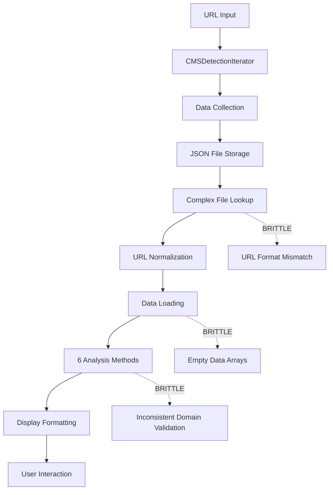
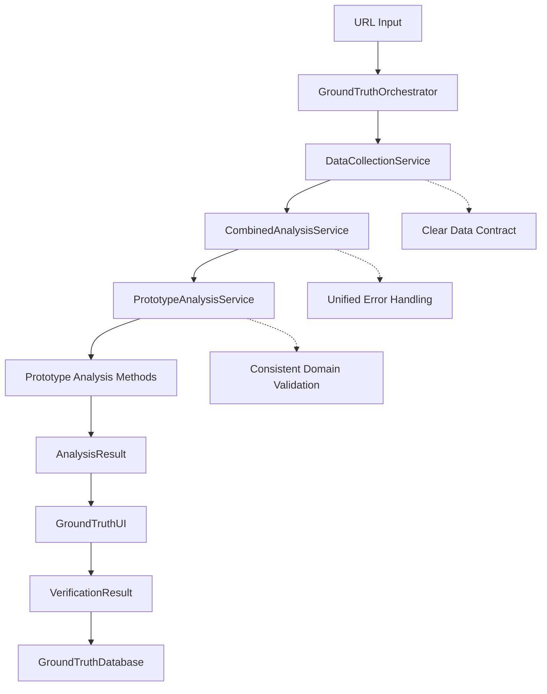

# Ground-Truth Command: Complexity Analysis and Refactoring Proposal

## Executive Summary

The ground-truth command has become dangerously complex and brittle, with **2,108 lines of code** and **46 methods** in a single monolithic class. This is **7x larger** than any other command in the codebase and represents a serious maintainability risk.

**Important Context**: The ground-truth command serves critical purposes that justify its complexity:

1. **Prototyping environment** for developing data-driven detection rules (separate from production CMS detection)
2. **Interactive analysis tool** for operators to efficiently analyze websites and build the ground-truth database (replacing manual Chrome DevTools inspection)  
3. **Bot-resistant detection architecture** using robots.txt-first analysis to bypass CloudFlare and other bot protection systems

These legitimate purposes justify having separate analysis logic, but the monolithic architecture still poses maintainability risks. **See `/docs/ground-truth-robots-txt-insight.md` for analysis of the critical bot detection advantage.**

## Current Complexity Issues

### 📊 Scale Comparison
| Command | Lines of Code | Methods | Complexity Ratio |
|---------|---------------|---------|------------------|
| ground-truth | 2,108 | 46 | **7.3x** |
| analyze-blocking | 285 | ~12 | 1.0x |
| detect_cms | 255 | ~8 | 0.9x |
| analyze | 283 | ~10 | 1.0x |

### 🏗️ Architecture Problems

#### 1. **Monolithic Design Anti-Pattern**
```typescript
class GroundTruthDiscovery {
    // 46 methods doing everything:
    // - Data collection management
    // - Analysis execution  
    // - Display formatting
    // - User interaction
    // - Database management
    // - URL normalization
    // - File I/O operations
    // - Error handling
    // - Version detection
    // - Signal analysis
}
```

#### 2. **Multiple Responsibilities (SRP Violation)**
The `GroundTruthDiscovery` class violates the Single Responsibility Principle by handling:

- **Data Collection**: Managing CMSDetectionIterator and data storage
- **Analysis**: Running 6 different signal analysis categories
- **Display**: Formatting and presenting results to users
- **Interaction**: Managing readline interface and user prompts
- **Database**: CRUD operations on ground truth database
- **File Management**: Data file lookup and normalization
- **Version Detection**: Complex version extraction and validation

#### 3. **Legitimate Analysis Separation (ACCEPTABLE)**
```typescript
// ✅ ACCEPTABLE: ground-truth has prototyping analysis methods for data-driven rules
private analyzeScriptSignals(data: any)    // Prototype for rules generation
private analyzeHtmlSignals(data: any)      // Prototype for rules generation
private analyzeMetaSignals(data: any)      // Prototype for rules generation
private analyzeHeaderSignals(data: any)    // Prototype for rules generation
private analyzeStylesheetSignals(data: any) // Prototype for rules generation
private analyzeVersionSignals(data: any)   // Prototype for rules generation

// ✅ SEPARATE PURPOSE: CMS detection strategies (production detection)
- HtmlContentStrategy  // Production detection logic
- ApiEndpointStrategy  // Production detection logic
- MetaTagStrategy      // Production detection logic
- HttpHeaderStrategy   // Production detection logic
```

**Understanding**: The ground-truth command serves as a prototyping environment for developing data-driven detection rules. Having separate analysis logic is acceptable and necessary for this purpose.

#### 4. **Mixed Concerns (CORE PROBLEM)**
The real issue is not separate analysis logic, but mixing different concerns in one class:

```typescript
// ❌ MIXED CONCERNS: All in GroundTruthDiscovery class
class GroundTruthDiscovery {
    // ✅ VALID: Interactive analysis for operator productivity  
    private analyzeScriptSignals()    // Prototype rules development
    private analyzeHtmlSignals()      // Prototype rules development
    
    // ❌ MIXED: Should be separate services
    private findDataFile()            // File management concern
    private promptForGroundTruthDecision() // UI interaction concern  
    private addToGroundTruth()        // Database management concern
    private normalizeUrlForGroundTruth() // URL handling concern
}
```

#### 5. **Brittle Data Flow**


**Known Failure Points**:
1. URL format mismatches between collection and analysis
2. Empty scripts array despite HTML containing scripts
3. Inconsistent domain validation across signal types
4. Silent failures in data file lookup

#### 6. **Complex State Management**
```typescript
// ❌ COMPLEX: Multiple interdependent phases in single method
async processUrl(url: string) {
    // Phase 1: Robots.txt analysis (✅ valid - prototyping)
    // Phase 2: CMS detection with data collection (✅ valid - data gathering)
    // Phase 3: Data file lookup (❌ should be service)
    // Phase 4: Comprehensive analysis (✅ valid - prototyping rules)
    // Phase 5: Display formatting (❌ should be UI service)
    // Phase 6: User interaction (❌ should be UI service)
    // Phase 7: Database operations (❌ should be database service)
}
```

The core analysis phases are valid, but they're mixed with infrastructure concerns that should be separate services.

## Impact of Current Complexity

### 🐛 **Bug Multiplication**
- **Current bug**: Scripts array empty despite HTML containing scripts
- **Previous bugs**: URL format mismatches, domain validation failures
- **Root cause**: Complex, interdependent systems with multiple failure points

### 🧪 **Testing Difficulties**
- **Large class**: Hard to unit test individual components
- **Mixed concerns**: Can't test analysis logic without user interaction
- **Complex setup**: Tests require extensive mocking of 4+ different systems

### 🔧 **Maintenance Overhead**
- **Single file changes**: Risk breaking multiple unrelated features  
- **Code understanding**: New developers need to understand entire 2,108-line file
- **Debugging complexity**: Issues span multiple concerns in same class

### 📈 **Technical Debt**
- **Future features**: Adding batch processing, export functionality becomes exponentially complex
- **Performance**: Monolithic design prevents targeted optimizations
- **Extensibility**: Adding new CMS types requires changes throughout the monolith

## Proposed Refactoring Architecture

### 🎯 **Design Principles**
1. **Single Responsibility Principle**: Each class has one reason to change
2. **Dependency Inversion**: Depend on abstractions, not concrete implementations
3. **Composition over Inheritance**: Build complex behavior from simple components
4. **Fail Fast**: Clear error boundaries and validation

### 🏗️ **Proposed Architecture**

```typescript
// ✅ PROPOSED: Modular architecture preserving prototyping capabilities

interface GroundTruthService {
    analyzeUrl(url: string): Promise<AnalysisResult>;
    saveVerification(result: VerificationResult): Promise<void>;
}

class GroundTruthOrchestrator implements GroundTruthService {
    constructor(
        private dataCollector: DataCollectionService,
        private analyzer: PrototypeAnalysisService, 
        private database: GroundTruthDatabase,
        private ui: GroundTruthUI
    ) {}
}

class DataCollectionService {
    // ✅ REUSE: Wrap existing CMSDetectionIterator and RobotsTxtAnalyzer
    async collectData(url: string): Promise<CMSDataPoint>;
}

class PrototypeAnalysisService {
    // ✅ KEEP: Prototype analysis methods for rules development
    private analyzeScriptSignals(data: CMSDataPoint): SignalResult[];
    private analyzeHtmlSignals(data: CMSDataPoint): SignalResult[];
    private analyzeMetaSignals(data: CMSDataPoint): SignalResult[];
    private analyzeHeaderSignals(data: CMSDataPoint): SignalResult[];
    private analyzeStylesheetSignals(data: CMSDataPoint): SignalResult[];
    private analyzeVersionSignals(data: CMSDataPoint): SignalResult[];
    
    async analyze(data: CMSDataPoint): Promise<AnalysisResult>;
}

class GroundTruthDatabase {
    // ✅ REUSE: File system utilities, URL normalization
    async save(site: GroundTruthSite): Promise<void>;
    async find(criteria: SearchCriteria): Promise<GroundTruthSite[]>;
    async getStatistics(): Promise<DatabaseStats>;
}

class GroundTruthUI {
    // ✅ REUSE: Console formatting utilities
    async promptForVerification(result: AnalysisResult): Promise<VerificationResult>;
    displayAnalysis(result: AnalysisResult): void;
    displayStatistics(stats: DatabaseStats): void;
}
```

### 📦 **Component Responsibilities**

#### **GroundTruthOrchestrator** (~50 lines)
- Coordinate the analysis workflow
- Handle high-level error recovery
- Manage command-line interface

#### **DataCollectionService** (~80 lines)  
- Wrap existing CMSDetectionIterator
- Handle data collection configuration
- Provide consistent data format

#### **CombinedAnalysisService** (~100 lines)
- Combine robots.txt, CMS detection, and signal analysis
- Provide unified analysis result
- Handle analysis-level errors

#### **PrototypeAnalysisService** (~600 lines)
- ✅ **KEEP existing prototype analysis methods**
- Focus on data-driven rules development
- Maintain separate from production CMS detection
- Provide comprehensive signal analysis for operator review

#### **GroundTruthDatabase** (~80 lines)
- Handle all database operations
- Provide clean data access interface
- Manage URL normalization consistently

#### **GroundTruthUI** (~100 lines)
- Handle all user interaction
- Format display output
- Manage readline interface

**Total Estimated Lines**: ~930 lines (56% reduction while preserving all prototyping capabilities)

### 🔄 **Data Flow Simplification**



**Benefits**:
- **Clear data contracts** between components
- **Unified error handling** at service boundaries  
- **Preserved prototyping capabilities** for rules development
- **Testable components** with focused responsibilities
- **Reused infrastructure** without affecting core analysis logic

## Implementation Strategy

### Phase 1: Extract Database Operations (Week 1)
```typescript
// Create GroundTruthDatabase class
// Move all database operations from GroundTruthDiscovery
// Implement clean data access interface
// Add comprehensive tests
```

### Phase 2: Extract UI Components (Week 1) 
```typescript
// Create GroundTruthUI class
// Move all display and interaction logic
// Implement consistent formatting interface
// Add UI-specific tests
```

### Phase 3: Extract Prototype Analysis Service (Week 2)
```typescript
// Create PrototypeAnalysisService preserving existing analysis methods
// Move all 6 analysis methods (Script, HTML, Meta, Header, Stylesheet, Version)
// Keep prototype logic separate from production CMS detection
// Add comprehensive analysis tests
```

### Phase 4: Create Data Collection Service (Week 1)
```typescript
// Wrap existing CMSDetectionIterator
// Provide consistent data collection interface
// Handle configuration management
// Add data collection tests
```

### Phase 5: Create Orchestrator (Week 1)
```typescript
// Create GroundTruthOrchestrator
// Wire all services together
// Implement error handling and recovery
// Add integration tests
```

### Phase 6: Migration and Cleanup (Week 1)
```typescript
// Update command-line interface to use orchestrator
// Remove old GroundTruthDiscovery class
// Update documentation
// Run comprehensive regression tests
```

**Total Estimated Time**: 6 weeks

## Risk Mitigation

### 🧪 **Testing Strategy**
1. **Unit tests** for each new service component
2. **Integration tests** for service interactions
3. **Regression tests** using existing ground truth data
4. **Performance tests** to ensure no degradation

### 🔄 **Migration Strategy**
1. **Feature flags** to switch between old/new implementations
2. **Parallel testing** with both systems during transition
3. **Gradual rollout** starting with non-critical functionality
4. **Rollback plan** to revert if issues discovered

### 📊 **Success Metrics**
1. **Code complexity**: Reduce from 2,108 to ~530 lines
2. **Test coverage**: Achieve >90% coverage for all new components
3. **Bug elimination**: Fix current scripts array bug and prevent regression
4. **Performance**: Maintain or improve current analysis speed
5. **Maintainability**: Enable adding new features with <50 line changes

## Benefits of Refactoring

### 🐛 **Bug Prevention**
- **Single source of truth** for analysis logic (reuse existing strategies)
- **Clear error boundaries** prevent cascading failures  
- **Focused testing** catches issues before they compound

### 🧪 **Testing Improvements**
- **Unit testable** components with clear responsibilities
- **Mockable dependencies** for isolated testing
- **Focused test suites** for each component

### 🔧 **Maintenance Benefits**
- **Small, focused classes** easy to understand and modify
- **Clear interfaces** between components
- **Composable architecture** for adding new features

### 📈 **Future Extensibility**
- **Batch processing**: Add BatchGroundTruthOrchestrator
- **Export functionality**: Add ExportService component  
- **Rules generation**: Extract patterns from PrototypeAnalysisService into data-driven rules
- **New analysis categories**: Add to PrototypeAnalysisService without affecting other components
- **Main CMS detection enhancement**: Port robots.txt-first architecture to improve standard detection success rates

## Conclusion

The ground-truth command has grown into a 2,108-line monolith that violates fundamental software design principles. The current architecture is:

- **7x more complex** than any other command
- **Prone to bugs** due to complex interdependencies
- **Hard to test** due to mixed responsibilities  
- **Difficult to maintain** due to monolithic design
- **Resistant to extension** due to tight coupling

The proposed refactoring will:

- **Reduce complexity** by 56% (2,108 → ~930 lines) while preserving all prototyping capabilities
- **Separate concerns** without eliminating necessary prototype analysis logic
- **Improve testability** through focused, single-responsibility components  
- **Prevent future bugs** through clear error boundaries
- **Enable easy extension** for rules generation and new analysis categories
- **Preserve operator productivity** with the same interactive analysis capabilities

**Recommendation**: Proceed with the refactoring to separate infrastructure concerns from prototype analysis logic. This maintains the ground-truth command's critical role as a prototyping environment while improving maintainability and reducing bug risk.