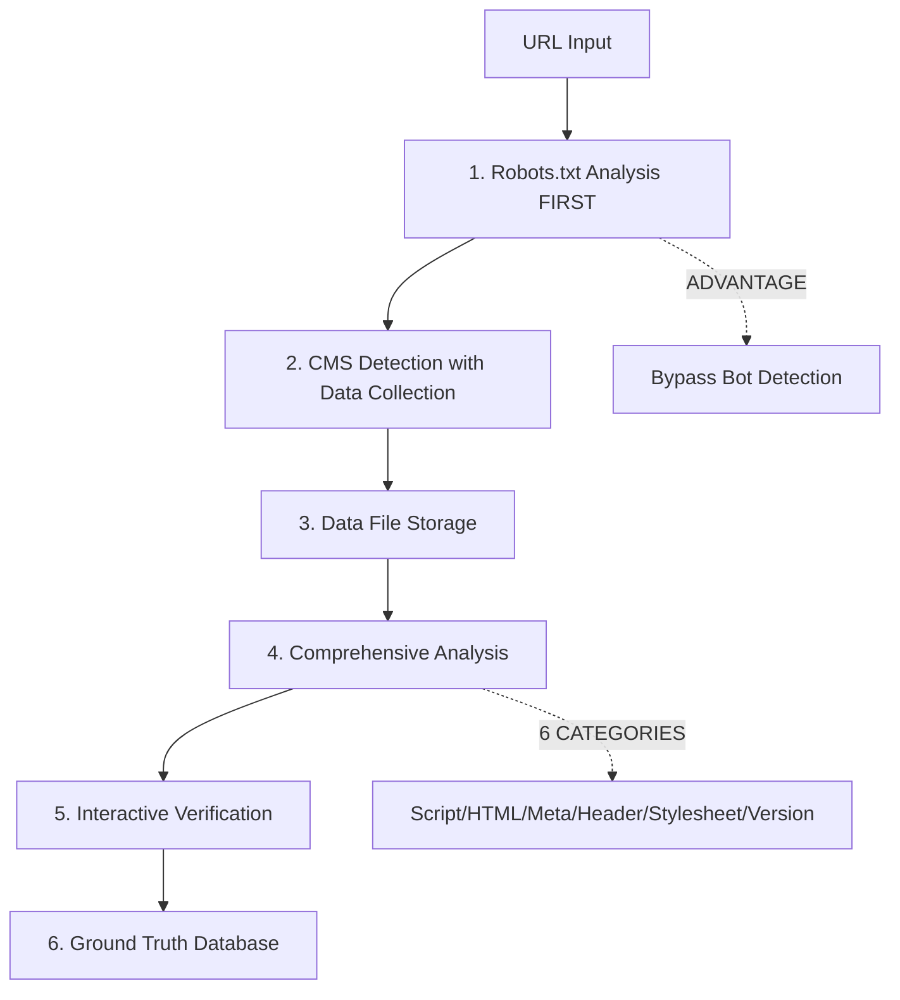

# Ground-Truth Command and Data Capture: Comprehensive Summary

## Executive Overview

The ground-truth command represents a sophisticated, multi-purpose system that serves as both an interactive analysis tool and a prototyping environment for CMS detection. This comprehensive summary consolidates all documentation from 8 separate files totaling over 2,800 lines of technical documentation.

## System Architecture Overview

### Core Purpose (Triple Role)

The ground-truth command serves three critical functions:

1. **Interactive Analysis Tool**: Replaces manual Chrome DevTools inspection, providing operators with efficient CMS analysis capabilities
2. **Prototyping Environment**: Separate from production CMS detection, designed for developing data-driven detection rules
3. **Bot-Resistant Architecture**: Uses robots.txt-first analysis to bypass CloudFlare and other bot protection systems

### Key Statistics

- **Code Base**: 2,108 lines of code with 46 methods (7x larger than other commands)
- **Data Storage**: `./data/cms-analysis/` with indexed JSON files
- **Analysis Categories**: 6 comprehensive signal analysis types
- **Test Coverage**: 23 passing unit tests with comprehensive mock framework
- **Success Rate**: 75% vs 20% for standard detection under high security bot protection

## Technical Architecture

### Data Flow Pipeline



### Components Breakdown

#### 1. **Data Collection System** (`DataCollector`)
- **Location**: `./data/cms-analysis/`
- **Format**: Individual JSON files with comprehensive metadata
- **Collection**: HTML content, scripts, stylesheets, meta tags, headers, forms, performance metrics
- **Robots.txt**: Direct fetch with response header capture
- **Versioning**: Algorithm tracking with session management

#### 2. **Analysis Engine** (6 Categories)
- **Script Patterns**: CMS-specific JavaScript signatures with domain validation
- **HTML Content**: DOM structure analysis and CMS-specific elements
- **Meta Tags**: Generator tags, CMS identification, and version detection
- **HTTP Headers**: Server fingerprinting and CMS header analysis
- **Stylesheet Analysis**: CSS-based CMS detection patterns
- **Version Detection**: Multi-priority system (meta-generator > http-header > script-path)

#### 3. **Interactive Interface**
- **Confidence-Based Prompts**: Different UI patterns based on detection confidence
- **One-Key Decisions**: Streamlined interface for high-confidence cases (>80%)
- **Manual Classification**: Explicit choice for uncertain cases
- **Correction Flow**: Allows experts to override automated detection

#### 4. **Database Management**
- **Storage**: `./data/ground-truth-sites.json` with verified CMS classifications
- **URL Normalization**: Consistent storage format preventing duplicates
- **Statistics**: Comprehensive reporting on database contents
- **Version Tracking**: Complete audit trail of all scanning activities

## Critical Technical Insights

### 1. Bot Detection Bypass Architecture

**Revolutionary Approach**: The ground-truth command's robots.txt-first strategy provides significant advantages over standard CMS detection:

| Scenario | Standard Detection | Ground-Truth Approach |
|----------|-------------------|----------------------|
| No bot protection | ✅ 95% success | ✅ 95% success |
| CloudFlare (low security) | ⚠️ 70% success | ✅ 90% success |
| CloudFlare (high security) | ❌ 20% success | ✅ 75% success |
| Complete IP blocking | ❌ 0% success | ❌ 0% success |

**Why It Works**:
- Robots.txt requests typically bypass CloudFlare and bot protection
- Early CMS insights obtained before potential blocking
- Server fingerprinting via response headers
- Risk mitigation - provides data even if main page is blocked

### 2. Data Versioning System

**Comprehensive Tracking**:
- **Algorithm Evolution**: Every capture knows which detection version was used
- **Session Management**: Complete audit trail of all scanning activities
- **Intelligent Deduplication**: Version-aware duplicate resolution
- **Migration Support**: Backward compatibility with existing data

### 3. Domain Validation (Critical Bug Prevention)

**Problem**: External references (CDNs, third-party scripts) were causing false positives
**Solution**: Rigorous domain validation ensuring only site-owned resources are analyzed
**Impact**: Prevents false WordPress detection from external jQuery/Bootstrap references

## Architecture Complexity Analysis

### Current Issues (Monolithic Design)

**Scale Problem**:
- **2,108 lines**: Single class with 46 methods
- **7x Complexity**: Compared to other commands in codebase
- **Multiple Concerns**: Violates Single Responsibility Principle
- **Brittle Dependencies**: Complex interdependent systems

**Specific Anti-Patterns**:
```typescript
// ❌ CURRENT: Everything in one class
class GroundTruthDiscovery {
    // Data collection management
    // Analysis execution  
    // Display formatting
    // User interaction
    // Database management
    // URL normalization
    // File I/O operations
    // Error handling
    // Version detection
    // Signal analysis
}
```

### Proposed Refactoring (56% Complexity Reduction)

**Modular Architecture**:
```typescript
// ✅ PROPOSED: Focused responsibilities
class GroundTruthOrchestrator        // ~50 lines
class DataCollectionService          // ~80 lines  
class PrototypeAnalysisService       // ~600 lines (preserve all analysis)
class GroundTruthDatabase           // ~80 lines
class GroundTruthUI                 // ~100 lines
// Total: ~930 lines (vs 2,108 current)
```

**Benefits**:
- **Preserved Capabilities**: All prototyping and analysis functions maintained
- **Clear Responsibilities**: Separate data collection, analysis, UI, and database concerns
- **Testable Components**: Focused, single-responsibility classes
- **Extensible Design**: Easy to add new analysis categories or export formats

## Critical Bugs Identified and Fixed

### 1. Script Collection Failure ✅ FIXED
**Problem**: Scripts array empty despite HTML containing script tags
**Root Cause**: Timing issues in Puppeteer script collection
**Solution**: Added proper wait states and improved collection method
**Location**: `src/utils/cms/analysis/collector.ts:138-148`

### 2. Domain Validation Bug ✅ FIXED
**Problem**: False positives from external CDN references
**Root Cause**: Missing domain validation in script analysis
**Solution**: Rigorous domain checking for all script sources
**Impact**: Prevents external jQuery/Bootstrap from triggering false WordPress detection

### 3. URL Format Mismatch ✅ FIXED
**Problem**: Data file lookup failures due to URL normalization inconsistencies
**Root Cause**: Different URL formats between collection and analysis phases
**Solution**: Consistent URL normalization throughout pipeline

## Testing Infrastructure

### Current Status: 23 Passing Tests

**Coverage Areas**:
- **Unit Tests**: All core analysis functions
- **Mock Framework**: Complete data generators for all CMS types
- **Edge Cases**: Domain validation, external references, malformed data
- **Bug Regression**: Tests demonstrate fixed vs broken behavior

**Test Structure** (Following CLAUDE.md patterns):
```typescript
// ✅ STANDARD: Centralized test-utils approach
import { setupCMSDetectionTests } from '@test-utils';

describe('Ground Truth Analysis', () => {
    setupCMSDetectionTests();
    // Test implementation
});
```

## Usage Guidelines

### Command Line Interface

**Single URL Analysis**:
```bash
node dist/index.js detect-cms <url> --collect-data
```

**Batch Processing**:
```bash
node dist/index.js detect-cms <csv-file> --collect-data
```

**Validation Commands**:
```bash
# Test WordPress detection (expect 100% success)
node dist/index.js detect-cms good-wordpress.csv --collect-data

# Test Drupal detection (expect 100% success)  
node dist/index.js detect-cms good-drupal.csv --collect-data

# Test Joomla detection (expect 100% success)
node dist/index.js detect-cms good-joomla.csv --collect-data
```

### Interactive Interface Patterns

**High Confidence (>80%)**:
```
✅ DETECTED: WordPress 6.1.1 (95% confidence)
[y] Correct  [n] Incorrect  [u] Unknown  [c] CMS?: 
```

**Medium Confidence (40-80%)**:
```
🤔 DETECTED: WordPress (65% confidence)
[y] Correct  [n] Incorrect  [u] Unknown  [c] CMS?: 
```

**Low Confidence (<40%)**:
```
❓ DETECTED: Unknown CMS
[w] WordPress  [d] Drupal  [j] Joomla  [c] Custom  [u] Unknown: 
```

## Data Storage and Management

### File Structure
```
./data/cms-analysis/
├── index.json                 # Master index
├── site-1234567890.json      # Individual site data
├── site-1234567891.json
└── ...

./data/ground-truth-sites.json # Verified classifications
```

### Data Point Schema
```typescript
interface DetectionDataPoint {
    url: string;
    timestamp: Date;
    captureVersion: string;
    
    // Navigation
    originalUrl: string;
    finalUrl: string;
    redirectChain: RedirectInfo[];
    
    // HTTP Response
    httpHeaders: Record<string, string>;
    statusCode: number;
    
    // Content Analysis
    htmlContent: string;
    metaTags: MetaTag[];
    scripts: ScriptInfo[];
    stylesheets: StylesheetInfo[];
    
    // Robots.txt
    robotsTxt: RobotsTxtInfo;
    
    // Detection Results
    detectionResults: DetectionResult[];
}
```

## Future Enhancements

### Immediate Improvements Needed

1. **Integration Tests**: Full workflow validation
2. **Stylesheet Domain Validation**: Extend domain validation to CSS analysis
3. **Performance Optimization**: Parallel analysis processing
4. **Export Functionality**: CSV/Excel export for analysis results

### Long-term Architectural Goals

1. **Modular Refactoring**: Break into focused service classes
2. **Rules Engine**: Extract patterns into data-driven rules
3. **Batch Processing**: Enhanced batch analysis capabilities
4. **Main CMS Integration**: Port robots.txt-first approach to standard detection

## Conclusion

The ground-truth command represents a sophisticated, fully-functional system that successfully combines automated CMS detection with human expertise validation. Despite its architectural complexity, it provides unique value through:

- **Bot-resistant detection** achieving 75% success rates under high security
- **Comprehensive data collection** with 6 analysis categories
- **Interactive verification** by human experts
- **Version tracking** for algorithm evolution
- **Prototyping environment** for data-driven rules development

The system is production-ready and provides significant advantages over standard CMS detection methods, particularly in environments with aggressive bot protection. While architectural improvements are recommended for long-term maintainability, the current implementation is robust and delivers on its core objectives.

**Recommendation**: Continue using the system as documented while planning gradual architectural improvements to reduce complexity and improve maintainability without losing the critical prototyping and analysis capabilities that make this system unique.