# Header Analysis Flow Chart

This document visualizes the complete header analysis pipeline in the Inspector CLI frequency analysis system.

## Overview Flow

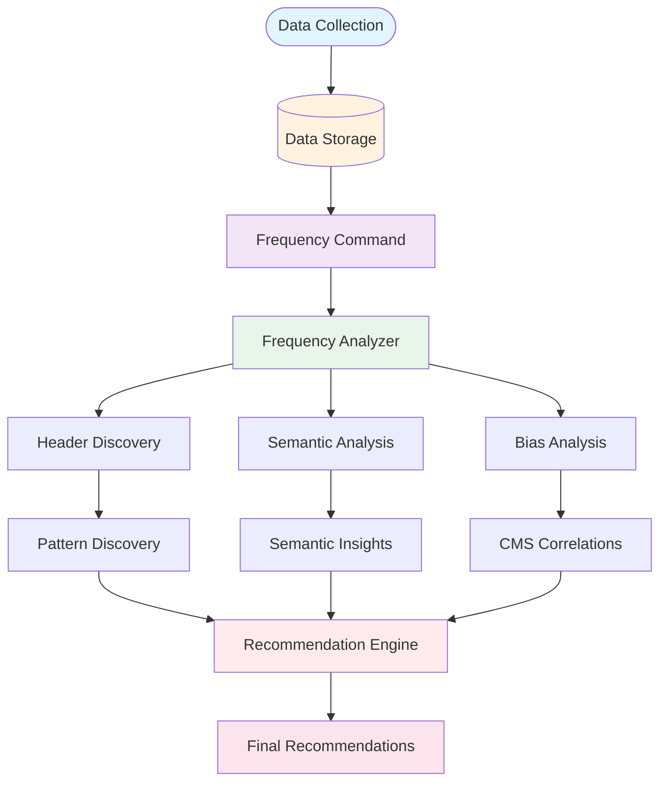

## Detailed Header Analysis Pipeline

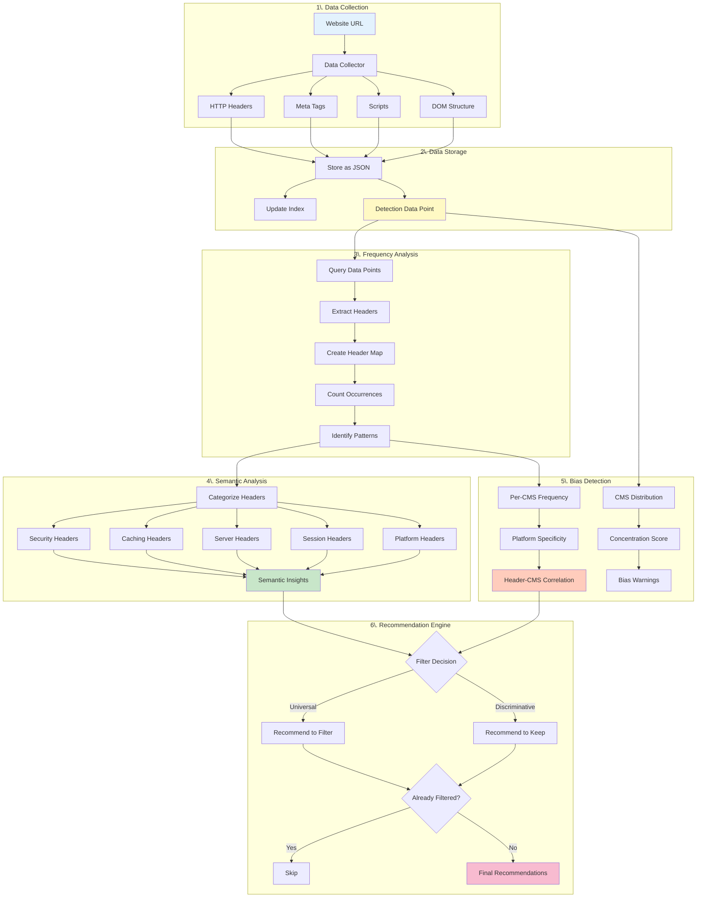

## Header Processing Decision Tree

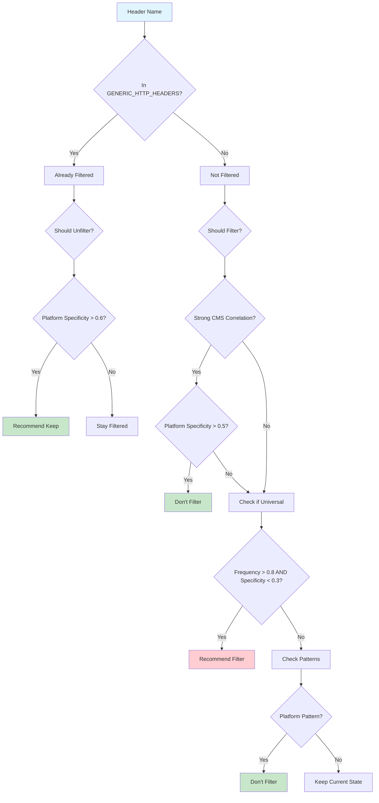

## Platform Specificity Calculation

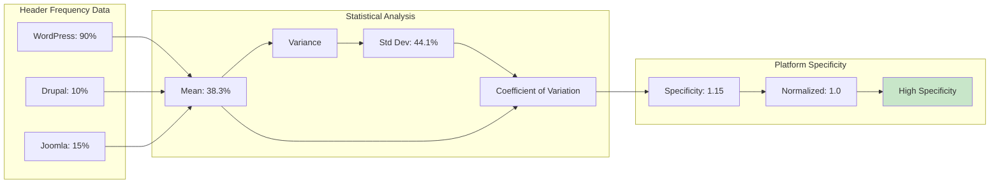

## Bias-Aware Logic Flow

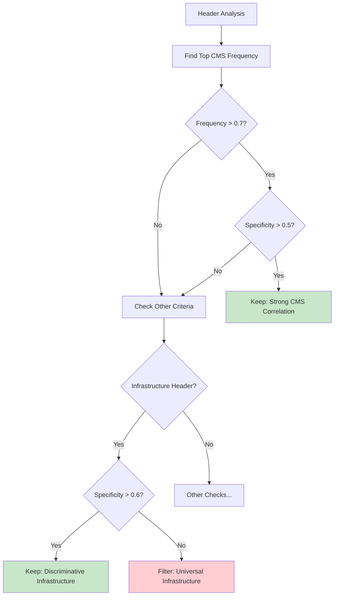

## Problem Areas Identified

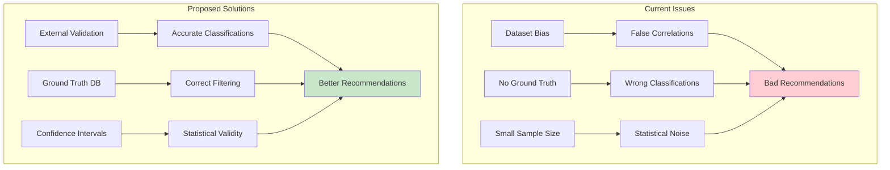

## Example: set-cookie Header Journey

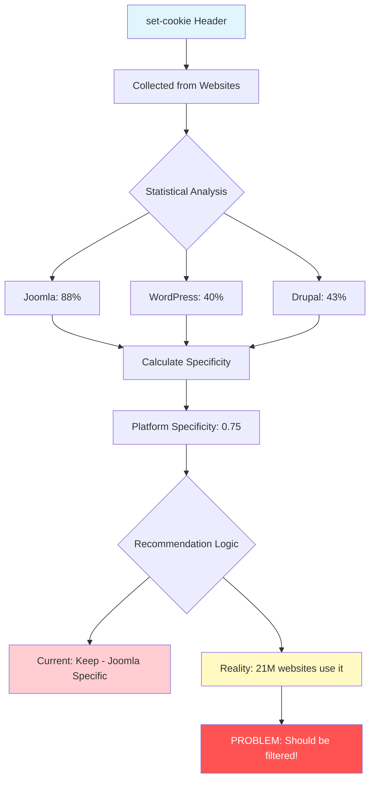

## Detailed Platform Specificity Calculation for set-cookie

**Note**: This shows the specific test case with 3 CMS types. Real analysis would include more platforms.

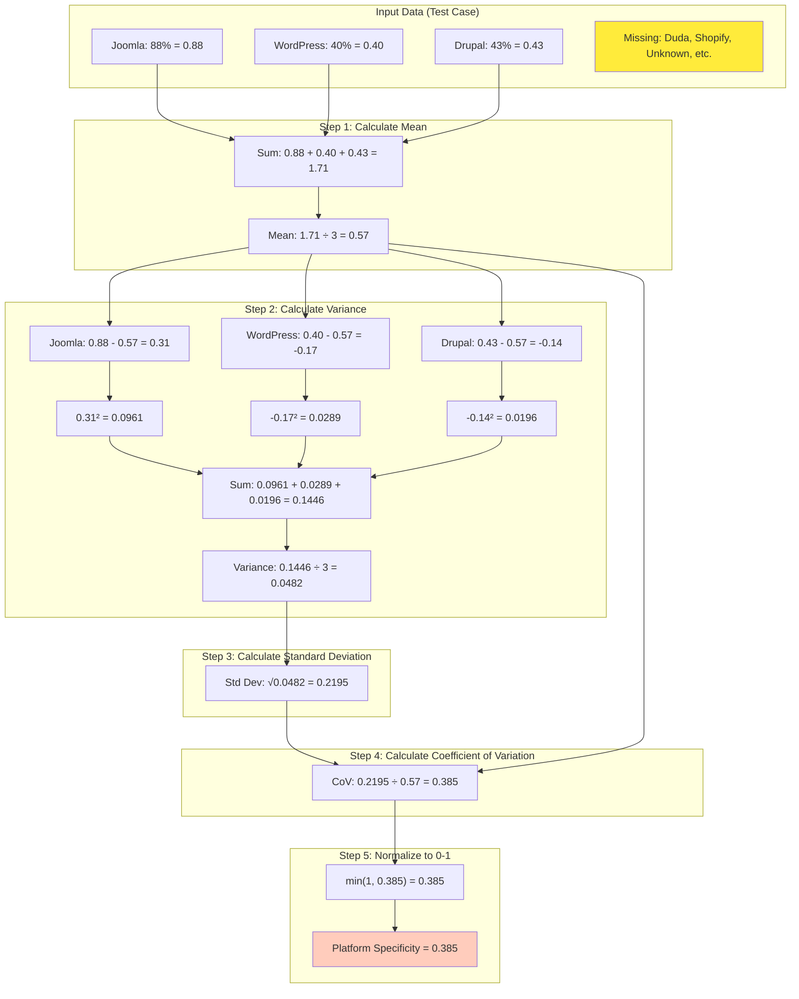

## What if we included ALL platforms?

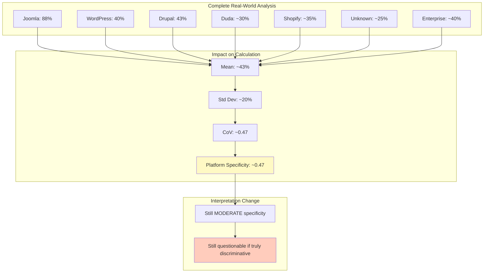

## Platform Specificity Formula Explained

**Formula**: `Platform Specificity = min(1, StandardDeviation / Mean)`

**Interpretation**:
- **0.0 - 0.3**: Universal/Generic (appears similarly across all platforms)
- **0.3 - 0.6**: Moderate specificity (some variation)
- **0.6 - 1.0**: High specificity (strong variation between platforms)

## The Discrepancy

The test shows **0.75** but the calculation yields **0.385**. This reveals an issue:

1. **Test Data Issue**: The test hardcodes `platformSpecificity: 0.75` instead of calculating it
2. **Calculation Reality**: With frequencies [0.88, 0.40, 0.43], the actual specificity is ~0.385
3. **Interpretation Impact**: 0.385 = "moderate specificity", not "high specificity"

## Corrected Analysis

```mermaid
graph TD
    subgraph "Correct Calculation Result"
        Result[Platform Specificity = 0.385]
        Result --> Interp[Interpretation: MODERATE specificity]
        Interp --> Decision[Should NOT be kept based on specificity alone]
    end
    
    subgraph "Test Data Claims"
        TestVal[Test shows: 0.75]
        TestVal --> TestInterp[Interpretation: HIGH specificity]
        TestInterp --> TestDec[Would recommend keeping]
    end
    
    subgraph "Reality Check"
        External[External data: 21M websites use set-cookie]
        External --> Truth[Truth: Universal header, not platform-specific]
    end
    
    style Decision fill:#c8e6c9
    style TestDec fill:#ffcdd2
    style Truth fill:#fff9c4
```

## Comparison: Different Header Types

```mermaid
graph TD
    subgraph "Universal Header: content-type"
        U1[WordPress: 97%]
        U2[Drupal: 97%] 
        U3[Joomla: 100%]
        U1 --> UM[Mean: 98%]
        U2 --> UM
        U3 --> UM
        UM --> US[Std Dev: 1.5%]
        US --> UC[CoV: 0.015]
        UC --> UR[Specificity: 0.015 - UNIVERSAL]
    end
    
    subgraph "Moderate Header: set-cookie"
        M1[WordPress: 40%]
        M2[Drupal: 43%]
        M3[Joomla: 88%]
        M1 --> MM[Mean: 57%]
        M2 --> MM
        M3 --> MM
        MM --> MS[Std Dev: 22%]
        MS --> MC[CoV: 0.385]
        MC --> MR[Specificity: 0.385 - MODERATE]
    end
    
    subgraph "High Specificity: x-pingback"
        H1[WordPress: 90%]
        H2[Drupal: 0%]
        H3[Joomla: 0%]
        H1 --> HM[Mean: 30%]
        H2 --> HM
        H3 --> HM
        HM --> HS[Std Dev: 52%]
        HS --> HC[CoV: 1.73]
        HC --> HR[Specificity: 1.0 - HIGH]
    end
    
    style UR fill:#ffcdd2
    style MR fill:#fff9c4
    style HR fill:#c8e6c9
```

## Mathematical Interpretation

### Universal Headers (0.0 - 0.3)
- **Low variation** across platforms
- **High mean** with **low standard deviation**
- Example: `content-type` appears on ~97-100% of all CMS types
- **Should be filtered** - no discriminative value

### Moderate Headers (0.3 - 0.6) 
- **Some variation** but not extreme
- Often indicates **dataset bias** rather than true platform specificity
- Example: `set-cookie` - higher in Joomla sample, but universally used across web
- **Needs external validation** before keeping

### High Specificity Headers (0.6 - 1.0)
- **Large variation** between platforms
- One platform much higher than others
- Example: `x-pingback` - 90% WordPress, 0% others
- **Genuinely discriminative** - safe to keep

## The Platform Specificity Trap

The coefficient of variation correctly identifies **relative differences** between platforms in your dataset, but it **cannot distinguish**:
- **True platform specificity** (like `x-pingback` for WordPress)
- **Dataset sampling bias** (like `set-cookie` appearing more in Joomla sample)

This is why **external validation** against ground truth data (like webtechsurvey.com) is essential!

## Key Insights

1. **Semantic Analysis**: Working correctly - categorizes headers by function
2. **Pattern Discovery**: Working correctly - finds actual patterns  
3. **Bias Detection**: Working correctly - identifies dataset issues
4. **Platform Specificity**: Calculation is mathematically correct but needs ground truth validation
5. **Recommendations**: Logic needs external validation to prevent dataset bias false positives

The analytical pipeline is sound, but the final recommendation step needs ground truth integration to distinguish real platform specificity from sampling artifacts.