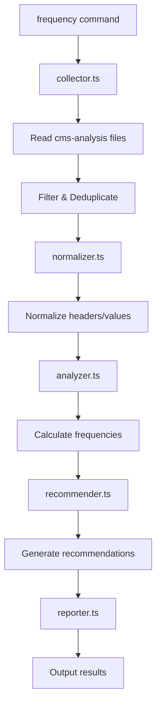

# Frequency Analysis Requirements

## Command Structure

This functionality will be implemented as a new `frequency` command in the Inspector CLI.

## Overview

This document defines the requirements for implementing frequency analysis of discriminative patterns across collected website data. The goal is to identify which headers, meta tags, and other patterns are truly discriminative for CMS/platform detection versus those that are generic across all platforms.

**Note**: This initial implementation focuses on frequency analysis of raw patterns without CMS detection correlation. CMS-based analysis will be added in a future iteration once we have ground-truth data.

## Core Requirements

### 1. Data Source and Scope

- **Source**: Use existing collected data from `data/cms-analysis/` directory (raw input data, not learn command output)
- **Deduplication**: For sites with multiple captures, use only the last good/complete capture
- **Temporal Tracking**: Record date/time of each capture for future filtering and trend analysis
- **Page-Level Tracking**: Track which page from a site was analyzed (mainpage vs. robots.txt)
- **Minimum Dataset Size**: Require at least 100 sites for statistically meaningful analysis

### 2. Data Elements to Track

#### 2.1 Headers

- **Full Name-Value Pairs**: Track both header name and value
    - Example: `x-powered-by: WordPress` (not just `x-powered-by`)
    - Empty values encoded as: `x-powered-by: <empty>`
- **Case Normalization**: Normalize header names to lowercase
- **Per-Page Headers**: Track headers separately by page type

#### 2.2 Meta Tags

- **Full Attribute-Value Pairs**: Track meta tag type and content
    - `name="generator" content="WordPress 6.0"`
    - `property="og:type" content="website"`
- **Empty values encoded as**: `generator: <empty>`

#### 2.3 Future Extensibility

Design system to easily add:

- Cookie names (from set-cookie headers)
- Script source patterns
- Link relations
- DOM patterns (classes, IDs, data attributes)

### 3. CMS Detection Tracking

**Deferred to Future Iteration**: CMS detection correlation will be added once ground-truth data is available for the analyzed sites.

### 4. Data Quality Requirements

#### 4.1 Good Data Criteria

- Successful data collection (no timeouts, errors)
- Non-error HTTP status codes (200, 301, 302, etc.)
- Not identified as bot detection page
- Not identified as error page (404, 500, etc.)
- Has minimum viable data (at least some headers and HTML content)

#### 4.2 Page Filtering

- Identify and filter out:
    - Bot detection pages (Cloudflare challenges, captchas)
    - Error pages (404, 500, maintenance pages)
    - Blank/empty responses
    - Pages with suspiciously low content

#### 4.3 Filtering Report
- Include a section in the output identifying which sites were filtered and why
- Track counts by filter reason (bot detection, error page, etc.)

### 5. Analysis Outputs

#### 5.1 Basic Frequency Metrics

For each distinct header/meta tag:

```
Header: x-powered-by
  Total occurrences: 45/100 sites (45%)
  Values:
    - "PHP/7.4.3": 20/100 (20%)
    - "WordPress": 15/100 (15%)
    - "Express": 8/100 (8%)
    - "<empty>": 2/100 (2%)
```

Sort values by occurrence frequency in descending order.

#### 5.2 Value Occurrence Report

For each header/value pair that meets minimum threshold (configurable, default 5 occurrences):

```
x-powered-by: WordPress
  Occurrences: 15/100 (15%)
  Page Distribution:
    - mainpage: 14/15 (93%)
    - robots.txt: 1/15 (7%)
```

#### 5.3 Statistical Metrics

- **Universality Score**: How common is this pattern across all sites? (percentage)
- **Value Diversity**: Number of unique values for each header
- **Top Values Report**: Most common values for each header

#### 5.4 Automated Filter Recommendations

The frequency analysis will provide recommendations for three commands:

##### 5.4.1 Current Usage Analysis
- **Learn Command**: Identify which headers/meta tags are currently filtered by discriminative filtering
- **Detect-CMS Command**: Identify which headers/meta tags are currently used in detection patterns
- **Ground-Truth Logic**: Review detection rules to identify which headers/meta tags are used

##### 5.4.2 Recommendations Report

```
LEARN COMMAND RECOMMENDATIONS
=============================
Headers Currently Filtered:
  - server (appears in 85% of sites)
  - cache-control (appears in 92% of sites)
  
Headers to Consider Filtering:
  - x-runtime (appears in 78% of sites, high diversity: 89 unique values)
  - x-request-time (appears in 65% of sites, high diversity: 100% unique values)
  
Headers to Keep (High Discriminative Value):
  - x-powered-by (15% occurrence, low diversity: 12 unique values)
  - x-generator (8% occurrence, low diversity: 5 unique values)

DETECT-CMS COMMAND RECOMMENDATIONS
=================================
New Pattern Opportunities:
  - Header "x-litespeed-cache" appears in 12% of sites, 95% correlation with WordPress
  - Meta tag "generator" with value "Joomla!" appears in 8% of sites
  
Pattern Refinements:
  - Current pattern for "x-powered-by: PHP" is too generic (appears in 35% of sites)
  
GROUND-TRUTH RECOMMENDATIONS
============================
Headers Used in Ground Truth:
  - x-powered-by (used in 15 rules)
  - x-generator (used in 8 rules)
  
Potential New Rules:
  - Sites with "x-drupal-*" headers (5% of sites) are likely Drupal
  - Meta tag "sailthru.platform" indicates custom platform integration
```

##### 5.4.3 Recommendation Criteria
- **High Universality (>70%)**: Recommend for filtering in learn command
- **High Diversity + High Frequency**: Likely non-discriminative (e.g., request IDs)
- **Low Diversity + Medium Frequency (5-30%)**: Potential detection patterns
- **Currently Filtered but Low Frequency (<5%)**: Consider removing from filters

### 6. Normalization Rules

#### 6.1 Header Normalization

- Convert header names to lowercase
- Trim whitespace
- Handle encoding variations

#### 6.2 Value Normalization

- **Case Normalization**: Convert values to lowercase for comparison (e.g., `WordPress` → `wordpress`)
- **Exact Value Matching**: Initially keep exact values without version stripping
- **Future Iteration**: Pattern grouping and version normalization to be added later

### 7. Technical Implementation Considerations

- **Incremental Processing**: Ability to add new captures without reprocessing everything
- **Memory Efficiency**: Stream processing for large datasets
- **Export Formats**: JSON, CSV, and human-readable reports
- **Filtering Capabilities**: Filter by date range
- **Caching**: Cache computed frequencies for performance

## Configuration Parameters

Based on the requirements analysis, the following parameters will be configurable:

1. **Minimum Occurrences Threshold**: Number of times a pattern must appear to be included in reports (default: 5)
2. **Minimum Dataset Size**: Minimum number of sites required for analysis (default: 100)
3. **Output Formats**: JSON, CSV, or human-readable report

## Implementation Phases

### Phase 1: Basic Frequency Analysis (Current)
- Raw frequency counts for headers and meta tags
- Value diversity metrics
- Per-page-type breakdowns
- Basic filtering and normalization
- Automated filter recommendations (see section 5.4)

### Phase 2: Pattern Analysis (Future)
- Co-occurrence patterns
- Header combinations
- Version normalization options

### Phase 3: CMS Correlation (Future)
- Integrate ground-truth CMS data
- Calculate discriminative scores
- CMS distribution analysis

### Phase 4: Advanced Analytics (Future)
- Temporal trend analysis
- Emerging/declining pattern detection
- Enhanced pattern correlation

## Summary of Decisions

1. **Data Source**: Use `data/cms-analysis/` for raw input data
2. **Normalization**: Lowercase normalization for both header names and values
3. **Version Handling**: Keep exact versions initially, iterate later
4. **Page Types**: Track and report separately (mainpage vs robots.txt)
5. **Minimum Thresholds**: 100 sites total, 5 occurrences per pattern
6. **CMS Analysis**: Deferred until ground-truth data available
7. **Advanced Features**: Co-occurrence, temporal analysis deferred to future iterations

## Implementation Architecture

### File Structure

Following the established pattern of learn and ground-truth commands:

```
src/
├── commands/
│   └── frequency.ts          # Thin command implementation
├── frequency/                # Feature folder
│   ├── index.ts             # Main exports
│   ├── types.ts             # TypeScript interfaces and types
│   ├── analyzer.ts          # Core frequency analysis logic
│   ├── collector.ts         # Data collection from cms-analysis files
│   ├── normalizer.ts        # Header/value normalization logic
│   ├── recommender.ts       # Filter recommendation engine
│   ├── reporter.ts          # Output formatting (JSON, CSV, human-readable)
│   └── __tests__/           # Test files
│       ├── analyzer.test.ts
│       ├── collector.test.ts
│       ├── normalizer.test.ts
│       ├── recommender.test.ts
│       └── reporter.test.ts
```

### Command Implementation

The `src/commands/frequency.ts` file should be thin, following the pattern of other commands:

```typescript
// Pseudo-code structure
export const frequency = new Command()
  .name('frequency')
  .description('Analyze frequency of headers and meta tags across collected sites')
  .option('--min-sites <number>', 'Minimum sites required for analysis', '100')
  .option('--min-occurrences <number>', 'Minimum occurrences to include in report', '5')
  .option('--output <format>', 'Output format: json, csv, human', 'human')
  .option('--output-file <path>', 'Save output to file')
  .option('--filter-recommendations', 'Include filter recommendations', true)
  .option('--page-type <type>', 'Analyze specific page type: all, mainpage, robots', 'all')
  .action(async (options) => {
    // Thin wrapper that delegates to frequency module
    const result = await analyzeFrequency(options);
    // Handle output
  });
```

### Core Module Responsibilities

#### `analyzer.ts`
- Main orchestration of frequency analysis
- Coordinate data collection, normalization, analysis, and reporting
- Calculate frequency metrics and statistics

#### `collector.ts`
- Read and parse files from `data/cms-analysis/`
- Handle deduplication (latest capture per site)
- Filter out bad data (bot detection, errors)
- Extract headers and meta tags

#### `normalizer.ts`
- Lowercase normalization for headers and values
- Handle encoding variations
- Trim whitespace
- Future: version normalization logic

#### `recommender.ts`
- Analyze current discriminative filters
- Review detect-cms patterns
- Review ground-truth rules
- Generate recommendations based on frequency data

#### `reporter.ts`
- Format output as JSON, CSV, or human-readable
- Generate recommendation reports
- Handle file output if specified

### Data Flow



### Integration Points

1. **Discriminative Filtering**: Read from `src/learn/filtering.ts` to analyze current filters
2. **Detect-CMS Patterns**: Read from CMS detection pattern files
3. **Ground-Truth Rules**: Read from ground-truth detection logic
4. **Data Source**: Read from `data/cms-analysis/` directory

### Existing Function Inventory (Required Before Implementation)

**CRITICAL**: Before implementing any new data collection or processing functionality, conduct a comprehensive inventory of existing functions that may be reusable.

#### Required Inventory Areas

1. **Data Collection Functions**
   - Search codebase for functions that read from `data/cms-analysis/` or similar directories
   - Identify existing file parsing, JSON handling, and data loading utilities
   - Document any existing deduplication or data filtering logic

2. **Data Processing Functions**
   - Look for existing header normalization functions
   - Find any meta tag parsing or processing utilities
   - Identify existing pattern matching or analysis functions

3. **CMS Detection Functions**
   - Inventory current detect-cms pattern matching logic
   - Document how existing ground-truth functions work
   - Identify any shared utilities between commands

4. **Reporting and Output Functions**
   - Find existing JSON, CSV, or report generation utilities
   - Look for file output handling functions
   - Check for existing formatting or display utilities

#### Implementation Decision Tree

```
For each required functionality:
├── Does equivalent function exist?
│   ├── Yes → Is it immediately usable?
│   │   ├── Yes → Use existing function
│   │   └── No → STOP and ask questions about:
│   │       ├── Whether to modify existing function
│   │       ├── Whether to create wrapper/adapter
│   │       └── Whether to create new function
│   └── No → Create new function following established patterns
```

#### Documentation Requirements

Before any implementation:
1. **Create inventory document** listing all relevant existing functions
2. **Document reuse decisions** for each piece of functionality
3. **Identify gaps** where new functions are needed
4. **Note any concerns** about modifying existing functions

This inventory ensures we:
- Avoid duplicating existing functionality
- Maintain consistency with established patterns
- Leverage existing battle-tested code
- Make informed decisions about when to reuse vs. create new

### Testing Strategy

Given that frequency analysis will inform critical decisions about filtering and detection patterns, comprehensive testing is essential for reliability and accuracy.

#### Test Categories

##### 1. Unit Tests (High Coverage Required)
Each module must have extensive unit tests with edge case coverage:

**collector.ts**
- File parsing accuracy (various JSON structures)
- Deduplication logic (multiple captures per site)
- Data quality filtering (bot detection, error pages)
- Edge cases: malformed JSON, missing fields, empty values
- Performance: large dataset handling

**normalizer.ts**
- Header name normalization (case, whitespace, encoding)
- Value normalization (case, special characters)
- Edge cases: null values, Unicode, very long values
- Consistency: same input always produces same output

**analyzer.ts**
- Frequency calculation accuracy
- Statistical metrics correctness
- Minimum threshold enforcement
- Edge cases: empty datasets, single site, all identical values

**recommender.ts**
- Current filter detection accuracy
- Recommendation logic validation
- Threshold-based decision making
- Integration with existing pattern files

**reporter.ts**
- Output format correctness (JSON, CSV, human-readable)
- Data integrity across formats
- File output functionality
- Large dataset formatting

##### 2. Integration Tests (End-to-End Accuracy)
Test the complete analysis pipeline with known datasets:

```typescript
// Example integration test structure
describe('Frequency Analysis Pipeline', () => {
  it('should produce accurate results for known dataset', async () => {
    // Given: curated test dataset with known patterns
    const testData = loadTestDataset('wordpress-drupal-mix');
    
    // When: running full analysis
    const result = await analyzeFrequency({
      minSites: 10,
      minOccurrences: 2,
      dataSource: testData
    });
    
    // Then: verify expected patterns
    expect(result.headers['x-powered-by'].frequency).toBe(0.4); // 4/10 sites
    expect(result.headers['x-powered-by'].values['wordpress']).toBe(0.2);
    expect(result.recommendations.learn.toFilter).toContain('server');
  });
});
```

##### 3. Data Validation Tests
Ensure analysis handles real-world data accurately:

**Test Fixtures Required:**
```
src/frequency/__tests__/fixtures/
├── known-wordpress-sites.json     # 20 verified WordPress sites
├── known-drupal-sites.json        # 20 verified Drupal sites
├── known-shopify-sites.json       # 20 verified Shopify sites
├── mixed-platforms.json           # 50 sites across platforms
├── edge-cases.json                # Malformed, empty, error pages
└── large-dataset.json             # 500+ sites for performance testing
```

**Validation Requirements:**
- Known WordPress sites should show WordPress-specific patterns
- Known Drupal sites should show Drupal-specific patterns
- Mixed datasets should show expected frequency distributions
- Edge cases should be handled gracefully without crashes

##### 4. Accuracy Verification Tests
Critical tests to ensure analysis reliability:

```typescript
describe('Analysis Accuracy', () => {
  it('should correctly identify discriminative vs non-discriminative patterns', () => {
    // Test with patterns we know are discriminative
    const discriminative = ['x-powered-by: WordPress', 'x-generator: Drupal'];
    const generic = ['server: Apache', 'cache-control: no-cache'];
    
    // Verify discriminative patterns get low universality scores
    // Verify generic patterns get high universality scores
  });
  
  it('should produce consistent results across multiple runs', () => {
    // Same input should always produce identical output
  });
  
  it('should handle deduplication correctly', () => {
    // Multiple captures of same site should use only latest
  });
});
```

##### 5. Performance Tests
Ensure the system scales with real datasets:

```typescript
describe('Performance', () => {
  it('should handle 1000+ sites within reasonable time', async () => {
    const startTime = Date.now();
    await analyzeFrequency({ dataSource: largeDat Dataset });
    const duration = Date.now() - startTime;
    expect(duration).toBeLessThan(30000); // 30 seconds max
  });
  
  it('should use memory efficiently', () => {
    // Monitor memory usage during large dataset processing
  });
});
```

##### 6. Recommendation Validation Tests
Test the recommendation engine against known good/bad patterns:

```typescript
describe('Recommendation Engine', () => {
  it('should recommend filtering for known generic headers', () => {
    const result = analyzeWithKnownData();
    expect(result.recommendations.learn.toFilter).toContain('server');
    expect(result.recommendations.learn.toFilter).toContain('cache-control');
  });
  
  it('should preserve known discriminative headers', () => {
    const result = analyzeWithKnownData();
    expect(result.recommendations.learn.toKeep).toContain('x-powered-by');
    expect(result.recommendations.learn.toKeep).toContain('x-generator');
  });
  
  it('should identify new pattern opportunities', () => {
    // Test with dataset containing patterns not in current detect-cms
  });
});
```

#### Test Data Requirements

**Ground Truth Datasets:**
- Manually verified CMS classifications for 200+ sites
- Known header/meta tag patterns for each CMS type
- Edge cases: custom CMSs, hybrid setups, static sites

**Quality Assurance:**
- All test datasets must be manually verified
- Regular updates as web technologies evolve
- Version control for test data with change tracking

#### Continuous Validation

**Regression Testing:**
- Run full test suite on every code change
- Compare results against baseline "golden" datasets
- Alert on unexpected changes in frequency patterns

**Data Drift Detection:**
- Monitor when real-world data differs significantly from test expectations
- Flag when new patterns emerge that aren't in test datasets

#### Success Criteria

Tests must demonstrate:
1. **Accuracy**: 99%+ correct frequency calculations
2. **Consistency**: Identical results across multiple runs
3. **Reliability**: Graceful handling of malformed data
4. **Performance**: Sub-30s analysis of 1000+ sites
5. **Recommendation Quality**: Recommendations align with manual expert analysis
